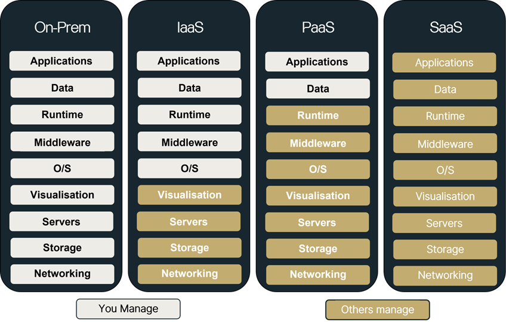
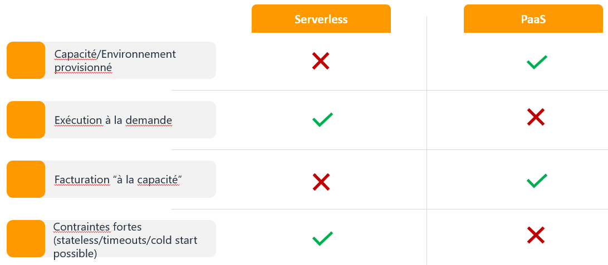
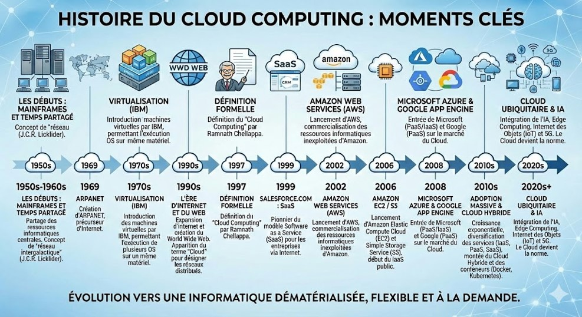
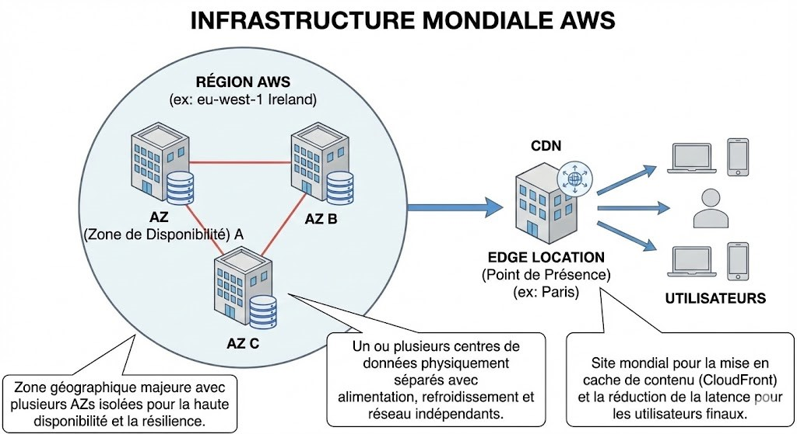
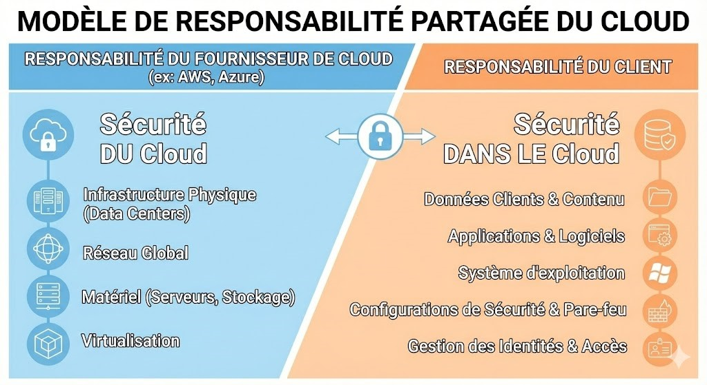
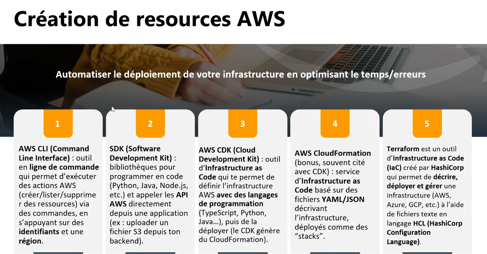

# AWS

This docs released by [Mouad Nassri](https://sudowr.com) under MIT License.

## What is Cloud?

Cloud refers to a collection of IT resources such as servers, storage, networking, databases, application services, and security tools. These resources are hosted in data centers and made available over the internet (or sometimes through a private network).

**Additional note:**
Instead of owning and maintaining physical infrastructure, you can access these resources on demand, which makes systems more scalable and flexible.

## What is Cloud Computing?

Cloud computing is a model where you access shared computing resources—such as servers, storage, and services—on demand over the internet. These resources can be quickly provisioned and are billed based on usage.
This model is often called **pay-as-you-go**, meaning you only pay for what you actually use, which helps reduce upfront costs and improves flexibility.

## Objectives and Key Points

### 1. Faster time-to-market

Quickly deploy applications and services

### 2. From CapEx to OpEx

Move from upfront infrastructure investment to pay-as-you-go pricing

#### CapEx and OpEx, what they are and what is the difference

CapEx (Capital Expenditure):
Money spent upfront to buy and own physical assets like servers, data centers, or networking equipment. It’s a long-term investment.

OpEx (Operational Expenditure):
Ongoing costs for using services, such as cloud resources, paid regularly (monthly or based on usage).

#### Key Difference

CapEx: Pay a large amount upfront, then maintain and use the asset  
OpEx: Pay smaller amounts over time, only for what you use

In cloud computing: CapEx is minimized, and OpEx becomes the dominant model (pay-as-you-go).

### 3. Scalability

Easily scale resources up or down based on demand

### 4. Improved resilience

Use features like multi-AZ deployments and managed services to increase availability

### 5. Standardization & automation

Use consistent architectures and automate deployments (e.g., Infrastructure as Code)

Additional note:
These goals help teams become more agile, reduce operational overhead, and focus more on delivering business value rather than managing infrastructure.

## Cloud Models: IaaS / PaaS / SaaS / Serverless

### IaaS (Infrastructure as a Service)

The provider delivers the infrastructure (servers, storage, networking). You have a high level of control (OS, configuration, application security), but you are responsible for more operations (patching, monitoring, hardening, availability).

### PaaS / Managed (Platform as a Service / Managed Services)

The provider manages the platform or a large part of the service (runtime, patches, high availability depending on options). You focus on code, configuration, and data, with less operational overhead than IaaS.

### SaaS (Software as a Service)

A complete, ready-to-use software accessible via the internet. The provider manages everything (infrastructure, platform, updates), and you mainly handle configuration and usage (accounts, settings, data).

### Serverless

You deploy code or event-driven components that run on demand with automatic scaling. You don’t manage servers, and you typically pay per usage, but you must follow certain constraints (stateless design, timeouts, IAM permissions).

Think of Serverless as → No servers, just code => You upload code → it runs automatically when triggered [Auto scaling, pay per execution]
No infrastructure needed, but some constraints (stateless, time limits)

**Additional note:**
These models form a spectrum: from **maximum control (IaaS)** to **minimum management (SaaS/Serverless)**

## Cloud Deployment Models: Public, Private, and Hybrid

## Cloud Timeline

## AWS Terminology (Essential Glossary)

### AWS Account

A primary container that groups billing, security (IAM), and resources. It acts as an administrative and governance boundary.

### AWS Service

A product provided by AWS that delivers a specific capability (e.g., compute, storage, networking).  
Examples include EC2, S3, and IAM.

### Resource

A concrete object created within a service.  
Examples include an EC2 instance, an S3 bucket, an IAM role, or a VPC.

## Pay-As-You-Go (Understanding Billing)

### Pay-As-You-Go

You only pay for what you use, with no upfront investment in servers.  
Billing depends on actual usage, such as:

- Compute time (execution time)
- Storage used
- Number of requests
- Network data transfer
- Sometimes provisioned components (e.g., reserved capacity)

### Key Idea (Exception)

On AWS, some services can incur costs even if they are not actively used.  
Examples include:

- Provisioned capacity
- Allocated storage
- Elastic IP addresses
- Reserved resources

> ⚠️ Important: Always release or stop unused resources to avoid unexpected charges.

## Exercice (Solution)

### 1. Répondre en 1 mot / 1 ligne

- **Donne une définition courte de cloud computing :**  
  Accès à la demande à des ressources informatiques via un réseau, facturé à l’usage.

- **Associe le bon modèle :**
  - Je gère l’OS → **IaaS**
  - Je déploie du code, pas de serveurs → **Serverless**
  - Logiciel prêt à l’emploi → **SaaS**

- **Donne 1 exemple pour chaque modèle :**
  1. **IaaS** → EC2
  2. **PaaS** → Elastic Beanstalk / RDS
  3. **Serverless** → Lambda
  4. **SaaS** → Office 365 / Google Workspace

- **Différence cloud public vs cloud privé (1 phrase) :**
  - **Public :** infrastructure partagée chez un fournisseur.
  - **Privé :** cloud dédié à une organisation (souvent on-premise ou dédié).

- **Donne un exemple concret de cloud hybride :**  
  Une partie on-premise + une partie sur AWS (ex : application legacy on-prem + stockage, backup ou front sur le cloud).

## Key Points About AWS Billing

### Compute (Instances / Containers / Functions)

Cost is based on:

- Execution time
- Resource size (CPU, memory)

### Requests (API Calls, S3 Operations)

Cost is based on:

- Number of operations (API calls, reads/writes, S3 requests)

### Storage (Volumes, Objects, Snapshots)

Cost is based on:

- Amount stored (GB)
- Sometimes the storage type (e.g., standard, infrequent access)

### Network (Data Transfer)

Cost is based on:

- Outbound traffic (egress)
- Traffic between Availability Zones (AZs)
- Traffic between regions

> ⚠️ Note: Network costs are often the #1 unexpected charge on AWS.

## Common AWS Cost Mistakes

### 1. Resources Left Running

- EC2, ECS, or RDS instances launched and forgotten
- These continue to generate costs even when idle

### 2. Overprovisioning (Wrong Sizing)

- Choosing larger instances “just to be safe”
- Leads to unnecessary spending on unused capacity

### 3. Costly Components Running Continuously

- Some resources incur charges all the time (e.g., certain network components, IPs, load balancers)

### 4. Poor Architecture Design

- Excessive data transfer between Availability Zones (AZs) or regions
- Inefficient design that increases network costs

### 5. Wrong Service Choice

- Using a service that doesn’t fit the use case (e.g., using EC2 instead of serverless)
- Can lead to higher cost and complexity

## Scalability (Scalabilité)

Scalability is the ability of a system to handle an increase in workload by adding resources.  
It is usually a strategic or planned decision.

> ⚠️ Note: On AWS, some scalable resources may still incur costs even when not actively used (e.g., provisioned capacity, storage, IPs).

### Vertical Scalability (Scale Up)

Increasing the power of a single machine by adding more resources (CPU, RAM).

**Example:**

- Upgrading from a `t3.micro` instance to an `m5.large`

### Horizontal Scalability (Scale Out)

Adding more machines to distribute the workload.

**Example:**

- Scaling from 1 web server to 3 web servers

> 💡 Horizontal scaling is commonly used in cloud environments for better availability and fault tolerance.

## Elasticity

Elasticity is the ability of a system to automatically increase **and decrease** resources in real time based on current demand.

It allows the system to scale up during traffic spikes and return to normal when the demand drops.

### Key Idea

Elasticity = **“the ability to adapt”**

### Comparison with On-Premise

- In traditional (on-premise) infrastructure, you can achieve **scalability** by buying more servers.
- But you **cannot achieve elasticity**, because you can’t release those servers when they are no longer needed.

> 💡 Elasticity is a core advantage of cloud computing and helps optimize both performance and cost.

### Difference between Scalability and Elasticity

Scalability → ability to handle growth (you add resources when needed)
Elasticity → ability to auto-adjust in real time (you add and remove resources automatically)

In one sentence: Scalability = can grow; Elasticity = can grow and shrink automatically

## Managed Services

A **managed service** is a cloud service where the provider (e.g., AWS) handles a large part of the technical operations, allowing you to focus on usage, configuration, and your data.

AWS Managed Services (AMS) is generally classified as a managed PaaS (Platform as a Service) because it provides an operational layer over infrastructure. AMS manages the infrastructure—patching, backups, security, and monitoring—so you can focus on building and deploying applications, which aligns with PaaS principles.

> ⚠️ Note: Some managed services may still incur costs even when not actively used (e.g., provisioned capacity, storage, IPs).

### What AWS Manages

- Infrastructure: servers, underlying storage, internal networking
- Maintenance: platform updates and security patches (depending on the service)
- Availability: redundancy and high availability (e.g., Multi-AZ setups)
- Basic monitoring: built-in metrics, logs, and alerts
- Automation: backups, restarts, node replacement, scaling (depending on the service)

### What You Manage

- Access & permissions (IAM): who can do what
- Configuration: service settings (size, options, networking, policies)
- Data: content, classification, encryption (if needed), retention
- Application security: validation, authentication, secrets management, business rules
- Overall design: architecture, cost optimization, performance, resilience

## Exercice 2 (Solution)

### 1. Donne la différence scalabilité vs élasticité en 1 phrase

- **Scalabilité :** capacité à supporter plus de charge (grandir).
- **Élasticité :** capacité à ajuster rapidement (up & down) selon la demande.

### 2. Cite 2 choses qui font souvent exploser une facture AWS

- Instances oubliées
- Stockage / snapshots
- Logs
- Egress (trafic sortant)
- NAT

### 3. Complète

- **Pay as you go =** facturation basée sur la consommation (usage).

### 4. Associe le type de coût

- **EC2 (compute)** → facturé souvent par **taille**
- **S3 (storage)** → facturé souvent par **stockage**
- **API Gateway (requests)** → facturé souvent par **nombre de requêtes**

## AWS Service Families (Mind Map)

### Compute

Services that provide computing power to run code, applications, or containers (virtual machines, functions, containers).  
Examples: EC2, Lambda, ECS, EKS, Elastic Beanstalk

### Databases

Managed database services (relational or NoSQL) where AWS handles part of the operations.  
Examples: RDS, Aurora, DynamoDB, ElastiCache, Redshift

### Storage

Services used to store data (files, objects, backups, archives) with options for durability, availability, and lifecycle management.  
Examples: S3, EBS, EFS, S3 Glacier

### Networking & Content Delivery

Services used to connect, route, secure networks, and distribute content (DNS, CDN, load balancing).  
Examples: VPC, Route 53, Elastic Load Balancing (ALB/NLB), CloudFront, Transit Gateway

### Analytics (Data & Analytics)

Services for collecting, processing, and analyzing data (ETL, queries, streaming, data warehousing).  
Examples: Glue, Athena, EMR, Kinesis, Redshift, OpenSearch

## AWS Service Famili`es (Mind Map)

### Management & Governance

Services used to monitor, audit, configure, and govern the AWS environment.  
Examples: CloudWatch, CloudTrail, AWS Config, Systems Manager, Organizations, Control Tower

### Developer Tools

Services for the development lifecycle (CI/CD, build, deployment, code management).  
Examples: CodeCommit, CodeBuild, CodeDeploy, CodePipeline, Cloud9

### Application Integration

Services that connect components using messages, events, or workflows.  
Examples: SQS, SNS, EventBridge, Step Functions, API Gateway

### Security, Identity & Compliance

Services for managing identities, permissions, encryption, protection, and compliance.  
Examples: IAM, KMS, Secrets Manager, WAF, GuardDuty

### AI/ML (Artificial Intelligence / Machine Learning)

Services to train and deploy models or use ready-to-use AI APIs.  
Examples: SageMaker, Bedrock, Rekognition, Comprehend, Textract

## AWS Global Infrastructure

### Region

A Region is a distinct geographic area (e.g., Europe/Paris, Europe/Frankfurt).  
Most resources (EC2, VPC, RDS, Lambda, etc.) are created within a Region.  
If you switch Regions in the AWS console, you may not see your resources.

### Availability Zone (AZ)

An Availability Zone is one or more isolated data centers within a Region.  
AZs are designed to be independent (power, network, connectivity) to reduce correlated failures.  
AZs within the same Region are connected through a low-latency network.

### Edge Location (Point of Presence / PoP)

An Edge Location is part of AWS’s global network located close to end users.  
It is used to deliver, accelerate, and secure traffic before reaching your AWS Region (where your main resources are hosted).

> 💡 Edge locations are commonly used by services like content delivery and caching to improve performance.

## Global vs Regional Services

### Global Services

AWS services whose scope is at the account level or the global AWS network, and are not tied to a specific region.  
Changing the region in the AWS console does not change their availability or “location”.

Examples: IAM, Route 53, CloudFront

### Regional Services

AWS services whose resources are created and managed within a specific region (e.g., Europe/Paris).  
When you switch regions, you see a different set of resources.

Examples: EC2, VPC, RDS, Lambda, ECS, API Gateway, S3 (buckets are region-specific)

## High Availability (HA)

High Availability is the ability of a system to remain accessible and continue functioning even when a component fails (server, network, or availability zone).

### Single AZ (One Availability Zone)

- Most (or all) components are deployed in a single Availability Zone
- Advantages: simpler to set up, often cheaper at the beginning
- Disadvantages: if the AZ has an issue (network, power, maintenance), the service becomes unavailable
- Key idea: Single AZ = single point of failure at the zone level

### Multi-AZ (Multiple Availability Zones)

- Critical components are deployed across 2 or more Availability Zones

Advantages:

- Fault tolerance: if one AZ fails, the other continues to serve traffic
- Safer maintenance: updates can be performed without fully stopping the service (depending on design)
- Better perceived availability for users

Disadvantages:

- Increased complexity (distribution, monitoring)
- Potentially higher cost (more resources and inter-AZ traffic)

[Cloud/Client Responsibilities](./images/ha.PNG)

## Exercice 3 (Solution)

1. Cite 5 familles AWS: Compute , Storage , Networking , Database , Security

2. Associe
   - EC2 → famille **Compute**
   - S3 → famille **Storage**
   - VPC → famille **Networking**
   - RDS → famille **Database**
   - IAM → famille **Security**

3. Vrai / Faux Changer de région change l’inventaire EC2 → **Vrai**

4. Classe : Global ou Régional ?
   - IAM → **Global**
   - EC2 → **Régional**
   - Route 53 → **Global**
   - Lambda → **Régional**

5. Pourquoi on utilise plusieurs AZ ? (1 phrase) : Pour assurer la tolérance aux pannes d’une zone et améliorer la disponibilité.

## Shared Responsibility Model (Responsabilité Partagée)

The Shared Responsibility Model defines how security and compliance responsibilities are divided between AWS and the customer.

### AWS Responsibilities ("Security of the Cloud")

AWS is responsible for:

- Physical data centers (buildings, hardware)
- Infrastructure (servers, storage, networking)
- Underlying services and platform availability
- Hardware and software maintenance (patching, updates at infrastructure level)

### Customer Responsibilities ("Security in the Cloud")

The customer is responsible for:

- Data protection (content, classification, encryption if needed)
- Identity and access management (IAM users, roles, permissions)
- Application security (authentication, authorization, secrets)
- Configuration of services (security groups, settings, network design)
- Operating system and application-level patching (depending on the service type)

> 💡 Rule of thumb: AWS secures the infrastructure, you secure what you put on the cloud.

---

Ramadan - Session 1

---

Amazon CloudFront is a fast, secure Content Delivery Network (CDN) service provided by Amazon Web Services (AWS) that accelerates the delivery of static and dynamic web content—such as images, videos, and APIs—to users globally. It uses a worldwide network of edge locations to cache content closer to viewers, reducing latency and improving performance.

Sometimes, aws does not place all services in all regions, there are some regions that may lack some services.

Sometimes also when you create an EC2 instance in a region and you change the region to other, you may not find your resources since you are not in a new region other than the region where you create yur resources.

There is a note: When using load balencer in front of a region to balence load between multi-az, the az each has a database, and this is handled by aws by creating a Master database to be the source of truth, and then it has replat of it called Standby replica and the synchronization is handdled automatically by aws, and when primary db is down, aws does failover and twist traffic into standby replica by promoting it and making it as master db.

Notice that s3 is outside AZ becuase s3 is a region service, and aws wutimatically handle ha of it.

Concerning databases, we have two ways to work with them in aws, either using rds, and rds does not give you the full flexibility and control, but if you want to host your database in a server to have control over it and dockerize it maybe, you can create EC2 instance and do it there. In short to have control and felxibility in using databases, you should use IaaS (EC2) instead of PaaS (RDS)

RDS is good if you want to avoid complexity of configuration and quickly start with already setup, you can go for rds

resources should not be exposed into internet, and we can only expose what we want based on architecture.

For example if we have a database resource, we should not allow ingress to enter to db fron outside, we just allow our instances to talk with databases. And maybe our webapp, because what we expose is the load balencer which in its turns it communicate with db.

Root is the account that create the aws account. It is not good to connect with root because it has the total access, instead we create IAM and we assign roles and permissions to it.

SSO: Single Sign-On is an authentication method that allows users to securely access multiple, independent applications or systems using a single set of credentials (username and password).

An Identity Provider (IdP) is a system that creates, maintains, and manages user digital identities, providing authentication services to applications, web services, or organizations.

After entering your console you see in thedomain that it has region in the first part, and it hange based on the region you are in.

To create IAM user, we need account Id from our account in root account

In menu in aws dashboard it lists services by family like compute family has all services in it. We also have search bar which has advenced search which search not just by service but also buttons and fnctionalty that has relation wuth your search query.

We also have cloud shell which has access on all resources and things that you have permissions to. you can run ls commands and run any command that you have permission in it.

You can do some steps to gain one more 100$ like spin up a new ec2 instance.

Security group & IAM: IAM users define who can and has role to access a resource and handle it, whereas security groups define some ip ranges ar a specific machine to access my instance on porotocol rdp on port 24, and things like that.

Go to support -> support dashboard -> support cases -> Create case -> Account and Billing

put Billing in service dropdown
put Phone validation in category

Using console gives you more strengths like: creaating resources easily with a simple clear UI, but the drawback is that it is manual and not automatic, and if you have several accounts and you want to spin up thesame resource you need to do it repeatedly and you may do errors and it is boring process and it is time consuming.

To solve this, we need to use tools to automatize deployments to automate the process.

---

Ramadan - Session 2

---

We can use cli (cloudshell) to create resources and handle all services within our aws account, and of course the user that we are connecting with cli should have roles and permissions, For exampele we can create buckets and handle ec2 instances fron aws cloudshell

We should never connect with root account, and we should create IAM users and assign least privileges permissions to those users and connect and handle our account with these accounts instead of root account.

Root account can do anything, but our IAM users cannot do some things like delete account, change payment modes and configs and cannot do anything to the ACCOUNT. We do that to secure our account.

We should also use MFA to secure our account to enhance more ou account access.

SSO: Single Sign-On is an authentication method that allows users to securely access multiple, independent applications or systems using a single set of credentials (username and password).

An Identity Provider (IdP) is a system that creates, maintains, and manages user digital identities, providing authentication services to applications, web services, or organizations.

We also use temporary session and autmatic expiration to reinforce security just like how sessions work in bank apps.

AWS CloudShell is a browser-based, pre-authenticated terminal that allows you to manage AWS resources directly from the AWS Management Console without installing tools locally. It provides a managed shell environment (Amazon Linux 2023) with popular development tools, such as the AWS CLI, Python, Node.js, and git, pre-installed and ready to use.

Account ID is unique per user, and all our users share the same account ID, so you should keep it, and when you want to connect through your IAMm you should provide this Account ID along with email and password.

Regions are not all activated by default, some of them yes, but many of them, you should activate them explicitly.

CloudShell when connect, it connects based on the user connected on aws account, (and it shows the region in the tab, so please before run any command make sure to verify in which region you are) and you can run commands like: **aws s3 ls** to list all s3 buckets, and you can list all files in a specific bucket with **aws s3 ls my-bucket**

CloudShell is very util to do quick commands to check, create file upload them quickly and manipulate things.

You can upload a file manually in cloudshell upload button, then run this command to copy the uploaded file into your bucket

aws s3 cp file.jpg s3://my-bucket

then check your bucket's content: aws s3 ls my-bucket

lets create a file in that bucket

The pattern of commands to handle any service is **aws <service> <command>** (24:00)

CloudShell has some restrictions in comparison with cli..

In dashboardm there is a widget of cost and usage which gives you a glance of your usage and predicted cost by the end of month based on your usage and activities along with your current budget and remaining days of your free tier

Work on the two TPs for IAM creation and Budget alerts

CloudFormation is service IaC developped by AWS based on YAML and JSON, and it is similar to Terraform, but terraform is cloud provider independant, that is why companies prefer it over cloud specific IaC.

AWS CDK, is a service that allow you to write you inforastructure using your prefered language like python, js.., and AWS CDK will transfer your code into CloudFormation yaml files or json files.

The core difference is that AWS CDK is for defining and deploying cloud infrastructure (Infrastructure as Code), while AWS SDK is for interacting with existing AWS services from within your application code at runtime. They are complementary tools and often used together.

---

Ramadan - Session 3

---

CloudWatch service is a service of monitoring, which has many sub services that allow you to monitor your apps, databases, billings..

MFA => Multiple Factor Auth

Difference between users and roles: Users get permissions to access resources in aws and manipulate them, Roles are for resources, and just like how users can manipulate serices by creating them and configure them, there are resources that do config and access services, just like an EC2 instance that store files in an s3 bucket. Here |EC2 need the explicit access in order to access s3, to do so, we create a role and attribute it to the ec2 resource, and that is done by attaching the policy that has access to s3 then we assign that role to the ec2 instance.

Least privilege, to give user or resource should have only the access that needs no more than that.

There is 2 types of permissions that we can attach to a role or to a user:

1. Permision handled by aws (they have a yello lock icon in their title) and they are already prepared y aws and it is like: giving total access to s3 ...
2. User defined customized permission: you can create a bucket in s3, and create a personalized permission and do an action needed, and then declare explicitly that permission

When authentication, it is intimidating to always enter username and password, especially in devops pipelines, so what you can do in this case, is to generate client credentials and secret, and use them when calling api, and you should not create them from root account, since the one who own that key can do anything later with it.
So you should always create those keys by a IAM account instead of root.

Security groups in AWS is like firewalls, used to tell aws who can access or do operation from ip X or port Y, don't allow him to enter.

Sometimes, calculating billing alarms costs, is not based only on consumed cost, but also on forcasted cost based on your activities, and it will send emails when treshold is reached.

There are two notions: budget alarm and billing alarm

First we will work in billing and cost management service to get emails and alarms for our budget and resources costs, but we can also create an alarm based on a bill in CloudWatch (Monitoring service), but cloudwatch cannot send emails and alerts, so when we create the alarm in cloudwatch, we neet to associate it with a subscription with a service called SNS (Simple Notification Service) and this service is the one who take care of sending notifications either text, email..

There are 3 states of alarm based on condition: In alarm, Ok and Insuficient data.

Please note that you should have 2 alarms systems: One is based on monthly threshould like Billing alarms to send alarms when your budget reach the amount specified as form of percentage, and you have CloudWatch where you specify fixed values oif youyr treshold, and the alarms are sent when your budget reach the treshold. The following table resume it:

**AWS Cost Monitoring Comparison**

| Feature                | AWS Budgets             | CloudWatch Billing Alarm       |
| ---------------------- | ----------------------- | ------------------------------ |
| **Budget / Threshold** | Budget: **$17/month**   | Threshold: **$10 (or custom)** |
| **Alert Type**         | Percentage-based alerts | Fixed amount ($) alerts        |
| **Forecasting**        | Includes forecast       | Based on estimated bill        |
| **Automatic Actions**  | Supported               | Email notification only        |
| **Check Frequency**    | 3 times per day         | Every 6 hours                  |
| **Free Tier**          | 2 budgets free          | 10 alarms free                 |
