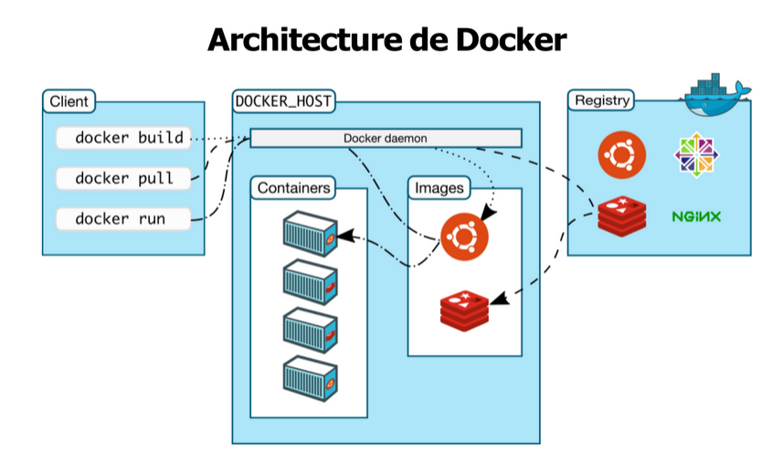

# Preparation for DevOps

## Part1: Docker

```md

```

Docker Engine is a client-server system used to run and manage containers on a machine.

It consists of:

**Docker Daemon (server):** a background process that creates and manages containers
**Docker CLI (client):** command-line tool used to interact with the daemon
**Container registry:** a library of images (e.g., Docker Hub)

In short, Docker Engine lets you manage containers using images through a client-server architecture.

Docker registries: DockerHub, (Nexus, Harbor.. those two are private regiostries)

**Docker Images (Containerisation):** Lightweight, fast-starting, resource-efficient, and process-isolated because they share the host OS kernel and include only the app + dependencies.

**VM Images (Virtualisation):** Heavy, slower to start, resource-intensive, and strongly isolated because each VM includes a full operating system with its own kernel.

---

**Docker Image Principles:** Built using a Union File System (overlay2) that combines multiple filesystem layers into one coherent filesystem view.

**Layers concept:** An image is made of stacked layers, each created by a Dockerfile instruction; only new layers are saved, keeping images lightweight.

**Base images:** Every image starts from a base image (e.g., ubuntu, alpine), which provides minimal OS libraries while sharing the host kernel.

**Image structure:** Layers represent incremental changes; they are read-only, while running containers add a writable layer on top that stores runtime changes and is removed when the container stops.

**Storage efficiency:** Layers are reused locally, so unchanged layers are not re-downloaded or duplicated, saving disk space.

**Performance benefits:** Layer reuse and shared base layers allow faster downloads, quick container startup, and efficient disk usage.

**Inspection tool:** `docker history image_name` shows all layers of an image.

---

**Docker image namespaces:** 3 types — official images, user/organization images, and self-hosted registry images.

**Official images:** Provided/maintained by Docker community or trusted sources (e.g., ubuntu, busybox, mysql, redis) and identified under the root namespace.

**User/organization images:** Named as `user/image` (e.g., tropars/myapp), where the first part is the Docker Hub username or org.

**Self-hosted images:** Stored in private or external registries, using full addresses like `registry.example.com:5000/my-private/image`.

**Searching images:** Docker search shows results with popularity (stars) and whether an image is official.

**Pulling images:** `docker pull` downloads images manually, while `docker run` pulls automatically if the image is missing locally.

**Tags:** Images can have versions like `redis:6.2.6` or variants like `redis:alpine`, default is `latest`.

Tags are optional for testing/prototyping or when using the latest version, but essential in production to ensure consistency, reproducibility, and the exact same image version across all environments.

### Docker Basics

- **Run a container:** `docker run hello-world`  
  → Checks local image → pulls from Docker Hub if missing → runs default command.

- **Image default tag:** `latest` (used if no tag is specified).

---

### Interactive container workflow

- **Start Ubuntu shell:** `docker run -it ubuntu`  
  → `-i` interactive, `-t` terminal

- **Inside container:**

```bash
apt-get update
apt-get install cowsay
exit
```

### Inspect container changes

- Inspect changes in a container:

```bash
docker diff f461e2e7afff
```

- Example output:

```text
C /var
C /var/log
C /var/log/apt
C /var/log/apt/history.log
A /var/log/apt/term.log
C /var/log/apt/eipp.log.xz
C /var/log/dpkg.log
```

- Meaning:

```text
C = modified file or directory
A = added file or directory
```

### First Docker Run

Command:

```bash
docker run hello-world
```

What happens:

1. Docker looks for image: `hello-world:latest`
2. Checks if image exists locally
3. If missing, downloads it from Docker Hub
4. Creates a container from the image
5. Runs the container's default command

Brief explanation of last step:

Every Docker image can define a default startup command (`CMD` or `ENTRYPOINT` in Dockerfile). When the container starts, Docker automatically executes that command. For `hello-world`, it runs a small program that prints a welcome message and exits.

### Save container as image

```bash
docker commit <container_id> <new_image_name>
```

Example:

```bash
docker commit f461e2e7afff myubuntu
```

What happens:

1. Docker captures container changes
2. Creates a new image layer
3. Saves it as a new image

Brief explanation:

`docker commit` creates a new image from a container's current state (installed software, modified files, configuration changes). Mostly useful for testing; Dockerfiles are preferred for production.

### Tag an image

```bash
docker tag <image_id> <image_name>
```

```bash
docker tag abc123 myubuntu:v1
```

What happens:

1. Associates a readable name/tag to an image
2. Makes images easier to identify and run
3. Tags can also be added during image creation

Run image using tag:

```bash
docker run myubuntu:v1
```

---

### Dockerfile Basics

A Dockerfile is a recipe used to build a Docker image automatically. Build image:

```bash
docker build -t myimage .
```

**Common instructions**:

- `FROM` → base image
- `LABEL` → metadata (author, version...)
- `WORKDIR` → working directory
- `RUN` → execute command during image build
- `CMD` → default command when container starts
- `EXPOSE` → document container port
- `COPY` → copy files/folders into image

Convention: Dockerfile instructions are usually written in UPPERCASE for readability.

Example:

```Dockerfile
FROM ubuntu
RUN apt-get update
RUN apt-get -y install cowsay
```

Key ideas:

1. Create Dockerfile inside an empty project folder
2. `RUN` commands should be non-interactive
3. `-y` automatically answers "yes" during installation
4. Dockerfile automates image creation instead of manual `docker commit`

**Build a Docker image**

```bash
docker build -t myimage .
```

- `-t` → tags the image with a name (e.g. `myimage`)
- `.` → build context (current directory where the Dockerfile is located)

**Key idea:** Docker uses the build context to access the Dockerfile and all required files, then builds the image step by step.

---

### What happens during `docker build`

The build context (current directory `.`) is sent to the Docker daemon. For each Dockerfile instruction:

- A temporary container is created to execute the step (`Running in ...`)
- Changes are saved as a new image layer (`---> ...`)
- The temporary container is removed
- The new image layer is used for the next step

Key idea:

Docker builds images step-by-step by creating temporary containers for each instruction and stacking the results as layers.

Key rules:

- Docker looks for Dockerfile in the root of the build context by default
- **-f** <path> can be used to specify a different Dockerfile location
- The Dockerfile must still be inside the build context

```bash
docker build -t my-app -f ../Dockerfile .
```

What each part means:

- -f ../Dockerfile → tells Docker where the Dockerfile is
- . → defines the build context (VERY important)

### Images management

```bash
docker image ls         # show images
docker image ls -a      # show all images including intermediate ones
docker image ls ubuntu  # List only ubuntu images
```

```bash
docker image rm <image_id>  # Remove an image
```

&lt;----&gt;:&lt;----&gt; type of images are intermediate imagfes created during build to store intermediate results of each `RUN`, `COPY`, etc. and help build the final image step by step

Tehy are useful, but indirectly: They are required for building images. They help Docker reuse cache and speed up builds

But You normally don’t run them and you don’t need to manage them manually, sso they are **hidden intermediate build layers that helped create your final image**

## Dangling images (images "qui pendouillent")

- **Definition:** an intermediate image that is no longer referenced by any tag or container, usually shown as `<none>:<none>`

- **Why it happens:** created during builds and replaced when a new image version is built. **Remove them:**

```bash
docker image prune
```

---

### Docker build context

- When building an image, Docker defines a **build context**
- Usually: the directory where you run `docker build`
- All files in this context are sent to the Docker daemon
- Only files inside the context can be used in the image (e.g. `COPY`)

**Best practice**:

- Create a dedicated folder containing:
  - Dockerfile
  - Only required project files

- Avoid using `/` as build context (too large, slow, unsafe)

**.dockerignore**: File used to exclude files from the build context. (Similar to `.gitignore`)

**Example**:

```text
node_modules
*.log
.env
```

**Key idea**: Docker can only access files inside the build context, so keep it small and controlled for efficiency and security.

---

### Shell vs Exec syntax (Dockerfile)

- **Shell form:** runs the command inside a shell (`/bin/sh -c` by default)

```dockerfile
RUN echo hello world
```

- Exec form: runs command directly (no shell), using JSON array format

```docker
RUN ["echo", "hello world"]
```

---

### Shell vs Exec syntax

- **Shell form:** easier to read, uses `/bin/sh -c`, supports shell features like variables

  ```dockerfile
  RUN echo $HOME
  ```

- **Exec form:** JSON format, no shell interpretation, does not require `/bin/sh`
  ```dockerfile
  RUN ["echo", "$HOME"]
  ```

Key idea:
Shell form = flexible (shell features), Exec form = strict and direct execution

---

### CMD vs ENTRYPOINT

- CMD defines the default command executed when no command is provided in `docker run`; only the last CMD in the Dockerfile is kept

```docker
  CMD ["echo", "hello"]
```

- ENTRYPOINT defines a command that is always executed when the container starts; r**ecommended to use exec form to avoid shell issues**

```docker
  ENTRYPOINT ["echo", "hello"]
```

**Key idea**: CMD provides a default overridable command, while ENTRYPOINT defines the fixed main command of the container

### CMD and ENTRYPOINT rules

Every Dockerfile must define at least one of: `CMD` or `ENTRYPOINT`. When both are used together:

- ENTRYPOINT defines the base command
- CMD defines default arguments

Both should use exec form:

```docker
  ENTRYPOINT ["app"]
  CMD ["--default-arg"]
```

At runtime:

- Only CMD is overridden by arguments in `docker run`
- ENTRYPOINT always stays fixed

**Key idea**: ENTRYPOINT = fixed command, CMD = default parameters that can be replaced

Example:

```dockerfile
FROM ubuntu

RUN apt-get update

RUN ["apt-get", "-y", "install", "cowsay"]

ENTRYPOINT ["/usr/games/cowsay","-e", "%%"]

CMD ["hello world"]
```

```shell
docker build -t mycowsay .
```

---

### Docker build cache (how it works)

- For each Dockerfile instruction, Docker checks if an identical layer already exists:
  - same base image
  - same command

- If yes → Docker reuses the cached image layer (no re-execution)

- If you rebuild without changes → build is almost instant (cache hit)

- If something changes → Docker rebuilds from that step onward and re-executes all following instructions

Key idea: Docker uses caching per layer to speed up builds, but a change invalidates all subsequent layers

---

### Docker cache behavior (RUN / COPY / ADD)

- For `RUN`: Docker compares the exact command string
  - Order matters:
    - `RUN apt-get install cowsay curl` ≠ `RUN apt-get install curl cowsay`
  - Even small changes invalidate cache

- `RUN apt-get update` is often cached and may NOT re-run even if repositories changed. .For `COPY` and `ADD`: Docker computes checksums of files. If files change → cache is invalidated, If unchanged → cached layer is reused

**Key idea**: Docker caching depends on exact command text for RUN and file checksums for COPY/ADD

---

### Docker cache tips

- Use correct order of instructions to optimize cache usage:
  - Put expensive steps (installations) early
  - Put `COPY` later when possible to avoid invalidating cache too often

- Cache optimization idea:
  - Small change in early layers → forces rebuild of all following layers

**Disable cache**:

```bash
docker build --no-cache .
```

**Key idea**: Good Dockerfile ordering improves build speed, while --no-cache forces a full rebuild

---

### View image history

```bash
docker history mycowsay
```

## Docker image history

| IMAGE ID     | CREATED        | CREATED BY                                   | SIZE   |
| ------------ | -------------- | -------------------------------------------- | ------ |
| 5439d59a9167 | 31 minutes ago | /bin/sh -c #(nop) CMD ["hello world"]        | 0B     |
| 62cf4b34d556 | 31 minutes ago | /bin/sh -c #(nop) ENTRYPOINT ["/usr/games/"] | 0B     |
| 68dd4625b571 | 37 minutes ago | apt-get -y install cowsay                    | 45.4MB |
| cb1643c4393c | 8 hours ago    | /bin/sh -c apt-get update                    | 32.6MB |
| d13c942271d6 | 38 hours ago   | /bin/sh -c #(nop) CMD ["bash"]               | 0B     |
| <missing>    | 38 hours ago   | /bin/sh -c #(nop) ADD file:122ad323412c2e70b | 72.8MB |

Shows all layers of a Docker image where each line corresponds to a Dockerfile instruction (RUN, CMD, ENTRYPOINT, etc.) and includes image ID, creation time, command, and size.

Key idea: A Docker image is made of layers, and docker history lets you inspect how it was built step by step.

---

### Dockerfile example (COPY usage)

```dockerfile
FROM ubuntu
RUN apt-get update
RUN apt-get install -y build-essential
COPY hello.c /
RUN make hello
CMD /hello
```

Key points:

- `hello.c` must be inside the build context (used by `docker build`)
- `COPY hello.c /` copies the file into the container at `/`
- Default working directory is `/`

Key idea: COPY brings files from the host build context into the image so they can be used during build

### Optimize Docker images

- Each Dockerfile instruction creates a new layer
- Fewer layers can improve performance (especially in older Docker versions)

Key idea: reducing the number of layers can help optimize image size and build efficiency, although modern Docker already handles layering efficiently.

---

### Publish images (Docker Hub)

- Images must be tagged before publishing: tagging only creates a reference, it does not rename the image
- Format includes registry address (default Docker Hub: index.docker.io)

### Commands

- `docker tag mycowsay mydockeraccount/cowsay:latest` → create a tagged reference for publishing
- `docker login` → authenticate to Docker Hub
- `docker push mydockeraccount/cowsay` → upload image to Docker Hub
- `docker pull mydockeraccount/cowsay` → download image from Docker Hub

Key idea: tagging + login + push is required to publish images to a registry

---

### Run containers

- `docker run --name mytest mycowsay` → start a container named "mytest" using image mycowsay
- `docker run --name test -it debian` → start an interactive Debian container with terminal access (-it)

Key idea: if `--name` is not used, Docker assigns a random name and ID; the container runs the default CMD/ENTRYPOINT.

---

### Container management commands

- `docker container ls` → list running containers
- `docker container start <id>` → start a stopped container
- `docker container stop <id>` → stop a running container
- `docker container restart <id>` → restart a container
- `docker container rm <id>` → remove a stopped container
- `docker container prune` → remove all stopped containers
- `docker container logs <id>` → view container logs
- `docker container stats` → show resource usage (CPU, memory)
- `docker container top <id>` → show running processes inside container

---

### Debug inside a container

```bash
docker exec -it <container_id> bash
```

Allows you to: run commands inside a running container and open an interactive shell and debug it.

---

### Docker networking basics

Containers are used for web apps, microservices, and databases, so networking is required to communicate with them. Key questions:

- How to access a container from outside?
- How to communicate between containers (same or different hosts)?

Example: `docker run -d -P nginx`

Check ports: `docker ps`

Example mapping:
container port 80 → host port 49153, so access: `curl localhost:49153`. Docker maps container ports to host ports so services inside containers can be accessed externally

---

### Port mapping in Docker

- Run container with custom port mapping:

```docker
docker run -d -p 8000:80 nginx
```

- Check **mapped ports**:

```docker
  docker port <containerID> 80
```

- Port mapping format:

```text
-p host_port:container_port
```

Example: 8000 (host) → 80 (container)

---

### Container IP

```docker
docker inspect --format '{{ .NetworkSettings.IPAddress }}' <container_id>
```

→ Get container IP address (ex: 172.17.0.2)

```bash
ping 172.17.0.2  # → Test connectivity to the container from host
```

---

### Docker networks (simple)

A Docker network is a virtual switch that creates a private subnet (default: 172.17.0.0/16) where each container gets its own IP and isolated network space.

It provides DNS for name resolution, NAT to expose services to the host, and allows multiple networks per machine so containers can be isolated or connected together across networks. A single container can be connected to multiple Docker networks at the same time.

### Docker network drivers

Docker network drivers define how containers connect to networks.

Main drivers:

- **Bridge** → default driver, used for containers on a single machine
- **Host** → container uses host network directly (higher performance, less isolation)
- **Overlay** → connects containers across multiple machines (used in Swarm/Kubernetes)
- **None** → disables networking (fully isolated container)

Key idea: drivers control how containers communicate depending on whether they run on one host or across multiple machines

### View existing networks

```bash
docker network ls  # shows default networks (bridge, host, none)
```

### Default networks

- bridge → default network for containers on same host
- host → uses host network directly (no isolation)
- none → disables networking

### Bridge network

- Allows containers on the same machine to communicate
- Each container has its own isolated network namespace
- Default bridge has limitations:
  - no automatic name resolution
  - may mix unrelated containers

### User-defined bridge (recommended)

```bash
docker network create -d bridge my_bridge  # create custom bridge network
```

```bash
docker run -d --network my_bridge --name cont2 ubuntu  # start container attached to custom bridge
```

```bash
docker network connect my_bridge cont1  # attach existing container to a network
```

**Key idea**: User-defined bridges allow isolated container groups with proper DNS-based name resolution, unlike the default bridge.

## Docker data management

Writing data inside a container is possible but has issues:

- data disappears when container is removed
- increases image size if baked into image
- hard to access from outside
- slower due to filesystem layers

---

### Volumes (recommended)

Managed by Docker and stored on host filesystem, can be shared between containers and persist after container removal.

```bash
docker volume create my-vol

docker run -d --name devtest --mount source=my-vol,target=/app debian
```

---

### Bind mounts

Direct mapping between host directory and container directory (mainly for development).

```bash
docker run -d -it --name devtest --mount type=bind,source="$(pwd)"/code,target=/app debian
```

### tmpfs

Stored in RAM, fast but temporary (lost on container stop).

---

## Docker Compose

**But Why Compose?**:
Managing multi-container apps manually is complex (networking, volumes, configs, ports). Compose solves this using Infrastructure-as-Code.

---

### What is Docker Compose

- Tool integrated with Docker Engine (`docker compose`)
- Uses a YAML file: `docker-compose.yml`
- Defines multi-container applications
- Works on a single machine

---

### How it works

- Describe services in YAML
- Run:

```bash
docker compose up
```

- Compose will:
  - create networks automatically (bridge)
  - pull/build images
  - start containers
  - configure volumes + ports

---

### Example structure

```yaml
version: "3.9"
  services:
    web:
      build: .
      ports:
      - "5000:5000"
      volumes:
      - .:/code
      - logvolume01:/var/log
      depends_on:
      - redis

    redis:
      image: redis

volumes:
  logvolume01:
```

---

### Key behaviors

One container per service || Auto-created bridge network
|| Service discovery via names (web → redis)
|| Port mapping (host:container)
|| build = build image from Dockerfile
|| image = use existing/pulled image
|| both → build is used, image names result

### Dependencies

- depends_on defines start order
- only ensures container start, not service readiness

### Volumes

- named volumes must be declared
- bind mounts allow host file access
- newer syntax supports explicit type: volume / bind

### Commands

```bash
docker compose up → start stack
docker compose up -d → start in background
docker compose ps → list running services
docker compose kill → stop services
docker compose rm → remove stopped containers
docker compose down → remove everything (containers, networks, volumes)
```

**Key idea**: Docker Compose lets you define and run multi-container applications using a single YAML file
