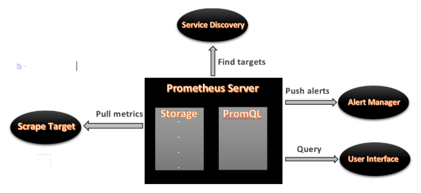

## What is Prometheus?

- Prometheus is an open-source monitoring tool, mainly used for metrics monitoring, event monitoring, alert management, etc.
- Prometheus uses a powerful **query language** called “**PromQL”**.
- In Prometheus, dashboards are enabled and it manages hundreds of services and microservices.

---

## Prometheus Architecture

---

## Prometheus Components

### 1. Prometheus Server

- The Prometheus server is the first component of the Prometheus architecture.
- It is the central component and is divided into storage, PromQL, HTTP server, etc.
- It pulls data from target nodes and stores it in the database.

#### 1.a Storage

- Storage is local disk storage.
- Prometheus supports integration with remote storage systems.

#### 1.b PromQL

Prometheus uses its own **query language**, PromQL. It is a very powerful query language which allows selecting and aggregating data.

---

### 2. Service Discovery

- It identifies services that need to be scraped.
- Required to discover targets and collect metrics.
- Helps monitor entities and locate targets.

---

### 3. Scrape Target

- Once services and targets are identified, metrics are collected and analyzed.
- Data can be exported using node exporters.
- Metrics are stored in local storage.

---

### 4. Alert Manager

- Manages alerts that occur during operation.
- Handles all alerts sent by Prometheus server.
- One of the most important components.
- Sends notifications via email, SMS, phone call, or chat applications.

---

### 5. User Interface

- Acts as a bridge between user and system.
- Prometheus UI is not very user-friendly but can be used for queries.
- Grafana is used for better dashboards and visualization.
- Grafana provides pie charts, line charts, tables, CPU usage, RAM usage, network load, etc.
- Grafana supports and works with Prometheus using the PromQL query language.
- PromQL is used to retrieve data from Prometheus and display results on Grafana dashboards.

## What is Grafana?

- Grafana is a free and open-source visualization tool mainly used with Prometheus to monitor metrics.
- It provides dashboards, charts, graphs, and alerts for a given data source.
- It allows querying, visualizing, and exploring metrics and setting alerts for systems, servers, nodes, clusters, etc.
- Users can create custom dynamic dashboards for visualization and monitoring.
- Dashboards can be saved and shared with team members, which is one of Grafana’s main advantages.

---

## What is Node Exporter?

- Node Exporter is a Prometheus exporter used to expose system or OS metrics.
- It exposes system resources such as RAM usage, CPU usage, memory usage, and disk space.
- It runs as a system service that collects system metrics.
- These collected metrics are visualized using Grafana.

## Ports of Promotheus, Grafana and NodeExporter

Please try toi remember the ports of each ofm these for exam:

**9090** (Prometheus), **3000** (Grafana), **9100** (Node Exporter)
