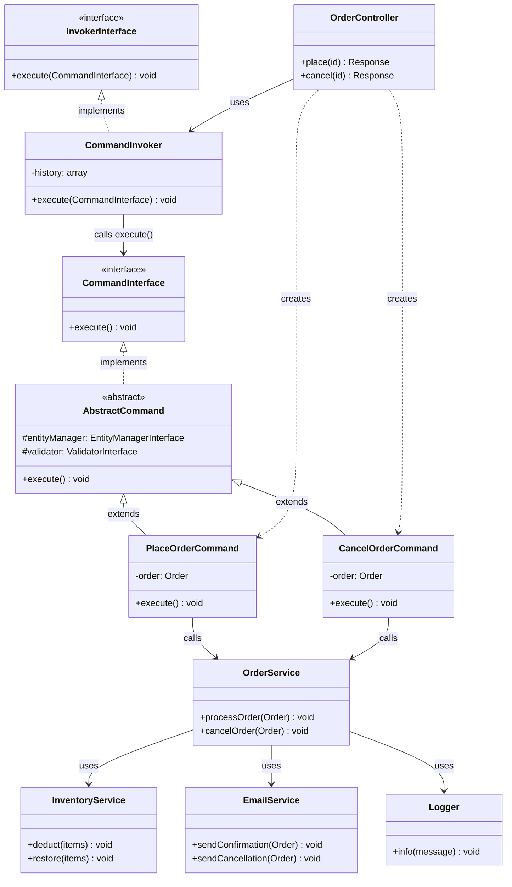

Concerning route parameters, always protect your params by using requirements and also narrow verbs by being specific on the request verb like following:

```php
[Route('/foo/{id}', requirements: ['id' => Rerquirements::POSITIVE_INT], methods: ["GET])]
public function getBook(int $id): Response
```

The name of router param, must be the same used in the Action parameter

After running any query or fetch, always pay attention to the profiler to verify the query executed and also the number of queries..

If you use a column other than id, use findOneBy() instead of find()

When showing buttons to do CRUD actions, use url() helper to generate the url to actions in buttons' href.

When editing, $em->persist() is optional you can omit it if you want

When defining routes, you can prefix it by redundant prefix by defining #[Route] above the controller class, and you can even prefix name if all your actions start with the same prefix

### Best practices

Always inject dependencies in controller constructor instead of actions
in best practices, you should not directly inject the repository, but instead you need to get the repository through entity manager, and that to prevent strong coupling on repository class

The reason for that is that you can later change the repository class for the entity and you find yourself obligated tyo change it also in controller

```php
$repository = $this->entityManager->getRepository(Book::class);
```

Now this way, ther entity manager will go to entity class, and get repository mentioned in #[ORM\Entity(repository: -----------)]

Now if you change the repo in entity, you don't have to change it in controller since controller already fetch the repo from there

---

In mapping entityies through route parameters, if you use a field other than id, you need to do the following (field:varname) otherwise you will get error

```php
#[Route(path: "/books/{isbn:mybook}")]
public function show(Book $mybook)
```

Always use this technique to make your code readable and clean, sdo instead of injkecting repository and get entity by id, and then check if the entity does not exist to throw 404 exception, EntityValueResolver does all of this for you

Read about EntityValueResolver

---

Now even if your code is clean, you still have entitymanager within your controller, and the logic for books handling inside controller actions cannot be tested (unit testing speaking not functional testing)

So to make ourt code testable unitly, you need to create services

### Command design pattern

Think of it like a **TV remote control**.

You press "Volume Up" — you don't care _how_ the TV increases volume internally. The button encapsulates the action. You can press it now, press it later, undo it, log it, queue it — the _what_ is separated from the _when_ and _how_.

The Command Pattern does exactly this in code:

> **It turns a request/action into an object.** That object can be passed around, executed later, logged, queued, or undone.

### The Four Players

**1. Command** : Interface defining `execute()`
**2. Concrete Command** : Implements the action (e.g., `PlaceOrderCommand`)
**3. Invoker** : Triggers the command — doesn't know what it does
**3. Receiver** : The actual business logic that does the work

### Let's understand it with an example

**- - > E-Commerce Order System**

Imagine you're building an order system. When an order is placed, you need to: deduct stock, send a confirmation email, and notify the warehouse. These steps should be queued, logged, and potentially undone.\*\*

**1. The Command Interface**

```php
// src/Command/CommandInterface.php
namespace App\Command;

interface CommandInterface
{
    public function execute(): void;
}
```

**2. Concrete Commands** (implement the above interface)

```php
// src/Command/PlaceOrderCommand.php
namespace App\Command;

use App\Entity\Order;
use App\Service\OrderService;

class PlaceOrderCommand implements CommandInterface
{
    public function __construct(
        private readonly Order $order,
        private readonly OrderService $orderService,
    ) {}

    public function execute(): void
    {
        $this->orderService->processOrder($this->order);
    }
}
```

```php
// src/Command/CancelOrderCommand.php
namespace App\Command;

use App\Entity\Order;
use App\Service\OrderService;

class CancelOrderCommand implements CommandInterface
{
    public function __construct(
        private readonly Order $order,
        private readonly OrderService $orderService,
    ) {}

    public function execute(): void
    {
        $this->orderService->cancelOrder($this->order);
    }
}
```

**3. The Receiver (Business Logic / The Service)**

```php
// src/Service/OrderService.php
namespace App\Service;

use App\Entity\Order;
use Psr\Log\LoggerInterface;

class OrderService
{
    public function __construct(
        private readonly LoggerInterface $logger,
        private readonly InventoryService $inventory,
        private readonly EmailService $emailService,
    ) {}

    public function processOrder(Order $order): void
    {
        $this->inventory->deduct($order->getItems());
        $this->emailService->sendConfirmation($order);
        $this->logger->info("Order {$order->getId()} processed.");
    }

    public function cancelOrder(Order $order): void
    {
        $this->inventory->restore($order->getItems());
        $this->emailService->sendCancellation($order);
        $this->logger->info("Order {$order->getId()} cancelled.");
    }
}
```

Please note that conceret commands are nothing but classes that use the service methods to implement a concret job, no more no less.

**4. The Invoker (the "remote control")**

This is the key piece — it knows _nothing_ about orders. It just fires commands.

```php
// src/Invoker/CommandInvoker.php
namespace App\Invoker;

use App\Command\CommandInterface;
use Psr\Log\LoggerInterface;

class CommandInvoker
{
    /** @var CommandInterface[] */
    private array $history = [];

    public function __construct(
        private readonly LoggerInterface $logger
    ) {}

    public function execute(CommandInterface $command): void
    {
        $command->execute();
        $this->history[] = $command;

        $this->logger->info('Executed: ' . $command::class);
    }

    public function getHistory(): array
    {
        return $this->history;
    }
}
```

**5. Wiring it Together in a Symfony Controller**

```php
// src/Controller/OrderController.php
namespace App\Controller;

use App\Command\PlaceOrderCommand;
use App\Command\CancelOrderCommand;
use App\Invoker\CommandInvoker;
use App\Repository\OrderRepository;
use App\Service\OrderService;
use Symfony\Bundle\FrameworkBundle\Controller\AbstractController;
use Symfony\Component\HttpFoundation\Response;
use Symfony\Component\Routing\Annotation\Route;

class OrderController extends AbstractController
{
    public function __construct(
        private readonly CommandInvoker $invoker,
        private readonly OrderService $orderService,
        private readonly OrderRepository $orderRepository,
    ) {}

    #[Route('/order/{id}/place', methods: ['POST'])]
    public function place(int $id): Response
    {
        $order = $this->orderRepository->find($id);

        // We create a command object and hand it to the invoker
        // The controller doesn't know HOW the order is processed
        $command = new PlaceOrderCommand($order, $this->orderService);
        $this->invoker->execute($command);

        return $this->json(['status' => 'Order placed']);
    }

    #[Route('/order/{id}/cancel', methods: ['POST'])]
    public function cancel(int $id): Response
    {
        $order = $this->orderRepository->find($id);

        $command = new CancelOrderCommand($order, $this->orderService);
        $this->invoker->execute($command);

        return $this->json(['status' => 'Order cancelled']);
    }
}
```

### Why This Matters (Team Lead Perspective)

**Without the pattern**, your controller calls `$orderService->processOrder()` directly — it's tightly coupled, hard to test, impossible to queue, and logging is scattered everywhere.

**With the pattern**, you get:

- **Decoupling** — the controller doesn't know what a command does, only that it _can_ be executed
- **Logging & Auditing** — the Invoker logs every command in one place
- **Queuing** — swap `execute()` for a Symfony Messenger `dispatch()` and your commands become async messages _for free_
- **Undo/Redo** — add an `undo()` method to your interface and you have full reversibility
- **Testability** — test each command in isolation with a mock receiver

> **Real talk**: In Symfony, the **Messenger component** is essentially the Command Pattern at framework scale. When you dispatch a `Message` and handle it with a `MessageHandler`, you're doing exactly this. Understanding the pattern manually first makes Messenger click instantly.

### Notes on the video course

What he did is that instead of commands directly implements the CommandInterface, he added an abstract class that has entityManager and also validatorInterface injected in constructor, and that is because all commands need those two to interact with db, so that instead of every command inject those two, it just get it from the abstract class, and that abstract class itself implmenet the CommandInterface

---

If you feel like a code get repeated in many actions in your service or controller, you can create a **trait** and put the redundant code in a method within that trait, then go to your service class and use th trait like

```php
class MyService {
	use ValidationTrait;
	public function foo() {
		boo(); # boo is a method in trait
	}
}
```

Always use `declare(strict_types=1)` to enforce typing

---

The whole Command design pattern diagram for easy understanding:



## Query design pattern & CQRS:

#### CQRS in one sentence

> Instead of one service that both reads and writes, you have **two separate pipelines** — one for changing data, one for reading data.

### Before CQRS — the normal way you write code today

```php
class OrderService
{
    public function placeOrder(int $userId, array $items): Order
    {
        $order = new Order($userId, $items);
        $this->em->persist($order);
        $this->em->flush();

        return $order; // ← writing AND returning data at the same time
    }

    public function getOrder(int $id): Order
    {
        return $this->repository->find($id);
    }
}
```

This works. But notice `placeOrder` is doing two things — **writing** to the DB and **returning** data. The read and write are mixed in the same service, same model, same everything.

### The CQRS rule

> A method either **changes something** and returns nothing, or **returns something** and changes nothing. Never both.

That's it. That's the core idea.

### After CQRS — split into two

**Write side — just does the action, returns nothing**

```php
class PlaceOrderCommand
{
    public function __construct(
        public readonly int   $userId,
        public readonly array $items,
    ) {}
}

class PlaceOrderCommandHandler
{
    public function handle(PlaceOrderCommand $command): void
    {
        $order = new Order($command->userId, $command->items);
        $this->em->persist($order);
        $this->em->flush();
        // no return — just do the job
    }
}
```

**Read side — just fetches, changes nothing**

```php
class GetOrderByIdQuery
{
    public function __construct(
        public readonly int $orderId,
    ) {}
}

class GetOrderByIdQueryHandler
{
    public function handle(GetOrderByIdQuery $query): OrderDTO
    {
        $order = $this->repository->find($query->orderId);

        return new OrderDTO(
            id:     $order->getId(),
            status: $order->getStatus(),
            items:  $order->getItems(),
        );
        // no writes — just return what was asked
    }
}
```

**Controller — calls each side directly, no bus, nothing fancy**

```php
class OrderController extends AbstractController
{
    public function __construct(
        private readonly PlaceOrderCommandHandler  $placeOrderHandler,
        private readonly GetOrderByIdQueryHandler  $getOrderHandler,
    ) {}

    #[Route('/order', methods: ['POST'])]
    public function place(Request $request): Response
    {
        $this->placeOrderHandler->handle(
            new PlaceOrderCommand(
                userId: $request->get('user_id'),
                items:  $request->get('items'),
            )
        );

        return $this->json(['status' => 'order placed'], 202);
    }

    #[Route('/order/{id}', methods: ['GET'])]
    public function get(int $id): Response
    {
        $order = $this->getOrderHandler->handle(new GetOrderByIdQuery($id));

        return $this->json($order);
    }
}
```

### What just happened

```
BEFORE                         AFTER
──────────────────────         ──────────────────────────────────
OrderService                   PlaceOrderCommandHandler  → void
  placeOrder() → writes        GetOrderByIdQueryHandler  → DTO
  getOrder()   → reads
  mixed together               completely separated
```

The controller injects the handler it needs directly. No bus. No magic. Just two focused classes each doing one thing.

---

Once this clicks, the Bus is just the next step — instead of injecting handlers directly in the controller, you inject one bus that routes to the right handler automatically. But that's an optimization, not the concept itself.

### What about Buses ?

the controller calls handlers directly. The Bus solves one specific problem that appears as your app grows.

### The problem buses solve

Right now your controller looks like this:

```php
class OrderController extends AbstractController
{
    public function __construct(
        private readonly PlaceOrderCommandHandler  $placeOrderHandler,
        private readonly CancelOrderCommandHandler $cancelOrderHandler,
        private readonly GetOrderByIdQueryHandler  $getOrderHandler,
        private readonly GetAllOrdersQueryHandler  $getAllOrdersHandler,
        // tomorrow: 5 more handlers...
        // next week: 5 more...
    ) {}
}
```

Your controller starts collecting every handler in the app. It becomes a dumping ground.

### What a Bus is

> A Bus is just a **middleman** that takes a Command or Query, looks at its class name, finds the right handler, and calls it.

Instead of this:

```php
$this->placeOrderHandler->handle(new PlaceOrderCommand(...));
```

You do this:

```php
$this->commandBus->dispatch(new PlaceOrderCommand(...));
```

The controller now only knows about **one object** — _the bus_. It doesn't care which handler exists or how many there are.

---

## How the Bus knows which handler to call

You tell it in configuration — a simple map of command class → handler:

```php
$commandBus = new CommandBus([
    PlaceOrderCommand::class  => $placeOrderHandler,
    CancelOrderCommand::class => $cancelOrderHandler,
]);
```

When you dispatch `PlaceOrderCommand`, the bus looks up its class name in the map and calls the right handler. That's the whole trick.

---

### The CommandBus — nothing magic

```php
class CommandBus
{
    public function __construct(
        private readonly array $handlers
    ) {}

    public function dispatch(object $command): void
    {
        $class = $command::class;

        if (!isset($this->handlers[$class])) {
            throw new \RuntimeException("No handler for {$class}");
        }

        $this->handlers[$class]->handle($command);
    }
}
```

### The QueryBus — same idea, but returns data

```php
class QueryBus
{
    public function __construct(
        private readonly array $handlers
    ) {}

    public function dispatch(object $query): mixed
    {
        $class = $query::class;

        if (!isset($this->handlers[$class])) {
            throw new \RuntimeException("No handler for {$class}");
        }

        return $this->handlers[$class]->handle($query);
    }
}
```

The only difference from CommandBus — it **returns** the result.

### The controller now — clean

```php
class OrderController extends AbstractController
{
    public function __construct(
        private readonly CommandBus $commandBus,
        private readonly QueryBus   $queryBus,
    ) {}

    #[Route('/order', methods: ['POST'])]
    public function place(Request $request): Response
    {
        $this->commandBus->dispatch(
            new PlaceOrderCommand(
                userId: $request->get('user_id'),
                items:  $request->get('items'),
            )
        );

        return $this->json(['status' => 'order placed'], 202);
    }

    #[Route('/order/{id}', methods: ['GET'])]
    public function get(int $id): Response
    {
        $order = $this->queryBus->dispatch(new GetOrderByIdQuery($id));

        return $this->json($order);
    }
}
```

No matter how many commands or queries you add in the future — the controller **never changes**.

---

## Before vs After

```
BEFORE                            AFTER
──────────────────────────        ──────────────────────────
Controller                        Controller
  injects PlaceHandler              injects CommandBus
  injects CancelHandler             injects QueryBus
  injects GetByIdHandler
  injects GetAllHandler           CommandBus
  calls each directly               map: Command → Handler
                                    dispatch() → finds & calls

                                  QueryBus
                                    map: Query → Handler
                                    dispatch() → finds & returns
```

---

## The full picture now

```
Controller
  │
  ├── commandBus.dispatch(PlaceOrderCommand)
  │         │
  │         └── looks up PlaceOrderCommand in map
  │                   │
  │                   └── PlaceOrderCommandHandler.handle()
  │                               │
  │                               └── writes to DB, returns void
  │
  └── queryBus.dispatch(GetOrderByIdQuery)
            │
            └── looks up GetOrderByIdQuery in map
                      │
                      └── GetOrderByIdQueryHandler.handle()
                                  │
                                  └── reads from DB, returns OrderDTO
```

Once you understand this, Symfony Messenger is just this same Bus — but with superpowers added on top like async queues, retries, and middleware. The concept is identical.
